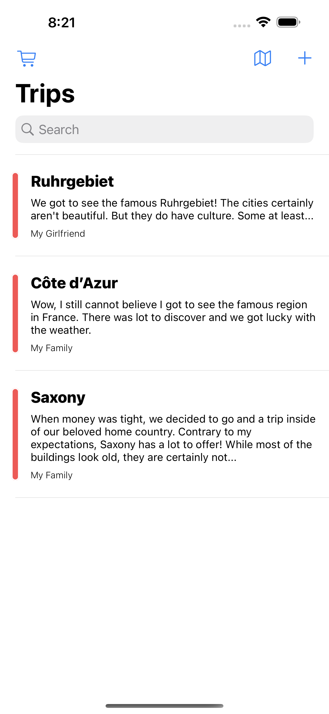

# TravelDex

## Introduction
TravelDex is an application I wrote to demonstrate my current programming skills. At the same time I tried to - and will continue to - build something that is of worth to other people. 

So what is TravelDex exactly? TravelDex aims to help you with remembering your beloved trips around the world. The app allows you to add locations to trips, comment on any locations you have visited and even enables you to see everything you have done so far on a map. You may build the project yourself or check it out on the Apple App Store in the near future.

## Architecture
For the most part, TravelDex is powered by CoreData, RxSwift and UIKit using the MVVM-Coordinator pattern. 

### CoreData
CoreData is used for three reasons:
1. Data Persistence
3. Object Graph Management
2. Observing State by Leveraging NSFetchedResultsController

In general, I do not think it is reasonable to let the view interact with NSManagedObjects directly. This is, why you will find a pure Swift struct for every entity defined in the NSManagedObjectModel. Stores are then used to translate from the realm of CoreData to our pure structs that may be used anywhere in the view.

### RxSwift
As usual in most MVVM applications, RxSwift is used to bind input from the view to the viewmodel and bind data from the viewmodel to the view.

The glue between RxSwift and CoreData is the class CDObservable, which lets you define any NSFetchRequest to observe changes to a NSManagedObjectContext.

### Testing
Most of the applications logic is tested. While I can provide you with some context inside the README.md, it may be a good idea to start your exploration of the architecture here.

At this time, there are no real UITests present.


## Building the Project
The project makes use of Cocoapods and Bundler. The following lines of code, run from the root directory of the project should be enough to get you up and running.
```
bundle install
bundle exec pod install
```
Open TravelDex.xcworkspace and run the TravelDex target. 

## Screenshots
  

You may have stumbled upon the other target MockedTravelDex. Its sole purpose in life is to provide the application with some sample data upon start. Thus, the target shares most of its code with TravelDex - except for the SceneDelegate. Have a look at MockedSceneDelegate and you will get the idea...
 
Run this from the root directory to create screenshots.
```
bundle exec fastlane snapshot
```
